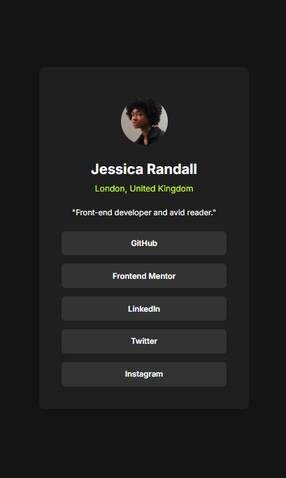

# Frontend Mentor - Social Links Profile Solution

This is my solution to the **Social Links Profile challenge** on Frontend Mentor.
The goal of this project was to build a clean and responsive social profile card where users can share links to their social media platforms.

---

## 📸 Screenshot

---

## 🔗 Links

* 🌐 **Live Site URL:** https://Haco31.github.io/TU-REPOSITORIO/

---

## 🛠 Built With

* Semantic **HTML5**
* **CSS3**
* CSS Box Model
* Responsive design basics

---

## 🎯 What I Practiced

Through this project I practiced:

* Structuring a UI component with **semantic HTML**
* Styling a card component with **CSS**
* Creating interactive **social link buttons**
* Managing spacing and alignment using the **CSS Box Model**

---

## 💡 What I Learned

This project helped reinforce key front-end development concepts such as:

* Organizing content inside a **card layout**
* Using **CSS hover effects** for interactive elements
* Improving visual hierarchy with typography and spacing

Small UI challenges like this are great for improving layout and styling skills.

---

## 📚 Challenge Source

This challenge was provided by **Frontend Mentor**, a platform designed to help developers improve their coding skills by building real-world projects.

https://www.frontendmentor.io

---

## 👨‍💻 Author

* GitHub – https://github.com/Haco31
* Frontend Mentor – https://www.frontendmentor.io/profile/Haco31

---

# Versión en Español

## 📖 Descripción

Este proyecto es mi solución al reto **Social Links Profile** de Frontend Mentor.

El objetivo fue construir una tarjeta de perfil con enlaces a redes sociales utilizando **HTML y CSS**, cuidando la estructura, el diseño visual y la interacción con los botones.

---

## 🚀 Tecnologías utilizadas

* HTML5
* CSS3

---

## 🎯 Qué practiqué

* Estructura semántica en HTML
* Creación de componentes tipo **card**
* Diseño de botones con efectos **hover**
* Manejo del **Box Model** en CSS

---

## 💡 Aprendizajes

Durante este proyecto reforcé habilidades importantes del desarrollo frontend:

* Cómo estructurar componentes visuales simples
* Cómo mejorar la jerarquía visual con tipografía
* Cómo crear botones interactivos para enlaces sociales

---

⭐ If you like this project, feel free to give it a star!
